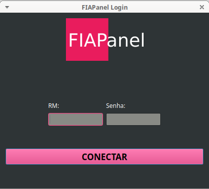

## FIAPanel

Este é um projeto de uma interface gráfica não-oficial do Portal do Aluno da FIAP. A ideia é de, no futuro, notificar quando há novos avisos, trabalhos e provas, e quando notas são lançadas. Desenvolvido em Python e Qt.

#### Porque em casa de ferreiro, espeto é de pau.

### Dependências:
* PyQT5
* BeautifulSoup
