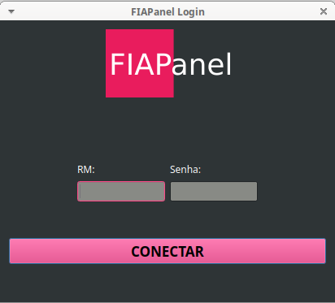

## FIAPanel

Este é um projeto de uma interface gráfica não-oficial do Portal do Aluno da FIAP. A ideia é de, no futuro, notificar quando há novos avisos, trabalhos e provas, e quando notas são lançadas. Desenvolvido em Python e Qt.

#### Porque em casa de ferreiro, espeto é de pau.

### Dependências:
* [PyQT5](https://pypi.org/project/PyQt5)
* [BeautifulSoup](https://pypi.org/project/BeautifulSoup)
* [Requests](https://pypi.org/project/requests/)

### Como usar

Vá na área de [Releases](https://github.com/nicmorais/FIAPanel/releases), clique em Assets e baixe o arquivo FIAPanel.zip

Depois, extraia o arquivo, acesse a pasta que havia dentro e execute o arquivo fiapanel.exe
